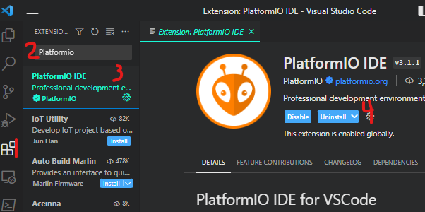
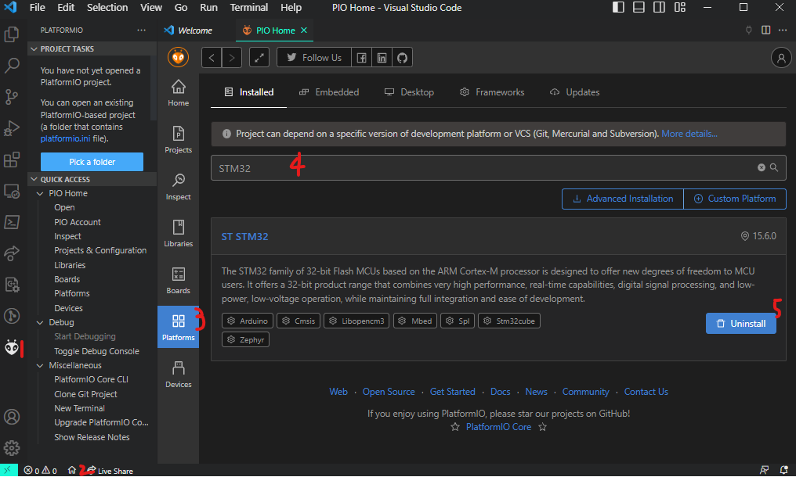
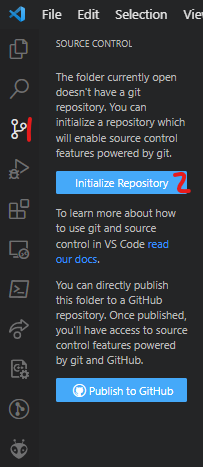

# Hello World

## Objectives

1. Install & use:
   1. VS Code
      1. Platformio GUI/CLI
         1. Build a Project
         2. Run tests with PlatformIO
   2. Git GUI/CLI
      1. Commit the project
2. Bare Metal Programming
   1. Flash a binary onto the microcontroller
   2. Make a code change
3. Software Practices
   1. Write functions to be tested
      1. `Err setBit(uint32_t* data, uint8_t n)`
      2. `Err clearBit(uint32_t* data, uint8_t n)`
      3. `Err invertBit(uint32_t* data, uint8_t n)`
      4. `Err maskBit(uint8_t* masked_bit, uint32_t data, uint8_t n)`
   2. Write unit tests for pre-defined functions
      1. `testAdd()`
      2. `testMac()`
      3. `testBitShftLft()`
      4. `testBitShftRt()`
4. Find basic microcontroler information in Reference Manuals
   1. Maybe add things here?

## Materials

- STM-Nucleo-F446RE
- USB-A to Mini-USB connector
- Computer (Windows, Mac, Debian-based [other Linux distros will likely work as well])

## Prelab

_I believe the entire prelab should be in an automatically-graded quiz._

1. What are the Board Specs
   1. FLASH?
   2. RAM?
   3. Operational Frequency?
2. Why can't I return from `main()`?
3. Should FP values be avoided on this board? Why, or why not?
4. What peripheral enables the system clock to other peripherals?
   1. Why aren't all peripherals enabled by default?
5. In the system’s memory table, are the peripheral registers higher or lower in address than the SRAM?
6. What information does each of the four main datasheets/manuals used in the labs provide?
7. Why don't devices recognize inputs/outputs on a chip by physical pin numbering?
8. What is the name of ST’s header file that defines names for the peripheral registers?
9. What peripheral do the HAL library delay functions use?
10. What bitwise operator would you use to:
    1. set a bit in a register?
    2. clear a bit in a register?
    3. invert a bit in a register?
    4. mask a bit in a register?

## Lab - Hello World

### Installation

1. PlatformIO runs on top of [Visual Studio Code (VS Code for short)](https://code.visualstudio.com), so go to the [VS Code site](https://code.visualstudio.com) to download that first. If running a debian-based OS, I suggest you use the *.deb package as it allows full access to the command line
2. Follow the [git installation instructions](https://git-scm.com/book/en/v2/Getting-Started-Installing-Git) to install Git
   1. Verify Installation
      1. Windows: Type "git" into the Windows Start search bar
      2. Mac, Linux: Open terminal, type `git --version` and verify that a version number is returned; not an error code
3. Install Platformio: \
   _"One IDE to rule them all; one IDE to find them._ \
   _One IDE to bring them all, and in the Dark Mode, bind them."_ \
   _- I.D.E. Token_
   1. Click on the _(1) extensions icon_ in the left-hand sidebar
   2. Enter **PlatformIO** into the _(2) extensions search bar_
   3. Select _(3) PlatformIO_ from among the results
   4. _(4) Install_ it (mine's installed already, so it says uninstall)
   5. Once installed, VS Code may need to reboot. \

4. Install `STM 32 Platform`
   1. Launch _(1) Platformio IDE_ by selecting the new icon on the left-hand sidebar (the one that appeared with the platformio installation; lookes like an ant head?)
   2. Click on the little _(2) house icon (PlatformIO Home)_ on the left side of the strip at the bottom of the window _(This will work as long as PlatformIO has been launched)_
   3. Select the _(3) Platforms_ tab in the PIO window
   4. _(4) Search_ for STM32
   5. Select _(5) Install_ \
   
5. Install and configure a linter to help you navigate & understand the c code
   1. Install the _Microsoft C/C++_ extension and follow one of the tutorials under **C/C++ extension tutorials per compiler and platform** _(I used [GCC and Mingw-w64 on Windows](https://code.visualstudio.com/docs/cpp/config-mingw))_


#### Optional - Open a new PlatformIO Project

_Throughout the semester, you will create one PlatformIO Project and steadily build upon it until you've created and tested your own library. Because of that, you won't need to create a new project, but it is nice to know how._

1. Open a new PlatformIO Project:
   1. Create a new VS Code window (Leave the Example Project open; we'll be using that)
      1. Select, File $\rightarrow$ New Window (Ctrl + Shft + N)
   2. Open the Platformio Home Page again:
      1. Launch Platformio by clicking on the icon on the left-hand sidebar
      2. Open the PlatformIO home page by clicking on the house button on the left side of the banner at the bottom of the window.
   3. Select "+ New Project" under the **Quick Access** section (above the Project Examples option) and enter the following information into the **Project Wizard:**
      1. Name: \<UID\>-new-project _(grades will be assigned based on the UID)_
      2. Board: STM Nucleo F446RE
      3. Framework: STM32 Cube _(You will fail if you use the Arduino Framework)_

### Platformio IDE

1. Copy and open the PlatformIO project
   1. Copy the project from: _**Path to Project here!!!**_ to a usable location on your computer. Prefix the project with your UID as follows: `u0000000-bare-metal` where `u0000000` is your UID
   2. Click on the PlatformIO icon on the left-hand sidebar to initialize PlatformIO core
   3. Select "Pick a folder", and select the project copied to your machine
2. Compile the code & upload the binaries to the microcontroller
   1. Connect the microcontroller to the computer using a mini-USB to USB-A cable
   2. Click the check mark on the right side of the banner towards the top of the window \
   _(The carat allows the additional options of: `build`, `test`,`upload`, and `clean`)_
   3. You'll notice an OUTPUT section appear in the bottom section of your window. If you do not see [SUCCESS], then there is a problem with your implementation
      1. There are other tabs in the OUTPUT section of the window (PROBLEMS, OUTPUT, DEBUG CONSOLE, TERMINAL, possibly others). Click on the TERMINAL tab.
   4. Scroll to the top of the terminal output; you'll see a command as follows; it's important: \
   `<prompt> > <path>/platformio.exe run --target upload`
3. Add platformio path (`<path>` from the previous prompt [`<prompt> > <path>/platformio.exe run --target upload`]) to system path
    1. [Windows - Add to path](https://www.architectryan.com/2018/03/17/add-to-the-path-on-windows-10/)
    2. [Linux - Add to path](https://linuxize.com/post/how-to-add-directory-to-path-in-linux/)
    3. [Mac - Add to path](https://osxdaily.com/2014/08/14/add-new-path-to-path-command-line/)
4. Open the terminal at the root of the project and explore PlatformIO's CLI (Command-Line Interface):
    1. Upload the compiled output of your code from the command line: \
      `platformio run --target upload`
    2. Explore the help information with the `-h` option (i.e. `platformio -h`)

### Git

Review the [git tutorial](https://git-scm.com/docs/gittutorial) before continuing on.

1. Create a git repo:
    1. Click on the _(1)git icon_ on the left-hand sidebar of VS Code
    2. Click on _(2) Initialize Repository_ \
    
2. Commit the changes thus far:
    1. Stage all current changes (there's a '+' sign by after you hover over Changes)
    2. Add a commit message
    3. Commit the changes
    4. A "Publish Branch" button replaces the Commit button; click on that and publish it to:
    `...`
3. Create a branch `unit-tests`
4. Add files from this repo
   1. Copy the file `hello-tests.c` from this repo to the directory `<prj>/test`
   2. Copy the file `functions-to-test.c` from this repo to the directory `<prj>/include`
5. Commit the changes on the CLI
   1. Open the terminal in the project directory
      1. In the top bar of the window (File, Edit, Selection, Go, etc.) open the menu for Terminal -> New Terminal
      2. Or press "Ctrl + Shift + \`" (maybe command for OSx)
   2. Add `<prj>/test/hello-tests.c` to the staged changes \
   `git add <prj>/test/hello-tests.c`
   3. Check the git status \
   `git status` \
   _You should only see the staged change `<prj>/test/hello-tests.c`
   4. Commit the change \
   `git commit`

Read the following articles on Git commit messages (there _will_ be a quiz on this):

- [11 tips for writing a good Git commit message](https://opensource.com/article/22/12/git-commit-message)
- [GitKraken.com - Writing a Good Git Commit Message](https://www.gitkraken.com/learn/git/best-practices/git-commit-message)

### Unit Testing

Unit testing is fundamental to software development, and will be one of your most useful tools when verifying that your code works; it's also how you'll be graded--in short, this is a big deal.

1. Install the **Native** platform to facilitate unit testing on your machine
   1. Open Platforms (Platformio Home $\rightarrow$ Platforms $\rightarrow$ Desktop)
   2. Click on the **Desktop** tab
   3. Search _"Native"_
2. Set up a testing environment
   1. Open `platformio.ini`
   2. Add the following code to create a native testing environment

   ```ini
   [env:unit-test]
   platform = native
   ```

3. Run the unit tests
   1. In the terminal, enter `platformio test -e unit-test`
4. Read the function descriptions found in `***.c` and write unit tests verifying each one works as described _(Hint: one should fail)_

_Make sure to commit after completing each test!_

### Bit Manipulation

1. Complete the functions called by the following unit tests:
    1. `void testSetBit()`
       1. `Err setBit(uint32_t* bits, uint8_t n)` $range_{bitNum} = [0,31]$ \
       _One design pattern we will use in this course is to return Error codes, rather than a typical result of the operations of the function. For that reason, the first argument of the function is almost always the "expected output" of the function. In order for that to work, the first argument must be passed in by **reference**, or by its pointer, rather than by **value**, which simply copies the information._
    2. `void testClearBit()`
       1. `Err setBit(uint32_t* bits, uint8_t n)` $range_{bitNum} = [0,31]$
    3. `void testMaskBit()`
       1. `Err maskBit(uint8_t* masked_bit, uint32_t data, uint8_t n)`

_Make sure to commit after each test passes!_

### Turn it in

1. Publish the repository to _**Add Remote Repository here!**_, then make a pull request
2. Merge the pull request. Your UID in the repo will be used to test and grade your submissions
3. You can verify your grade in the lab based on the tests passed and failed
   1. _Add instructions to see the test results_
